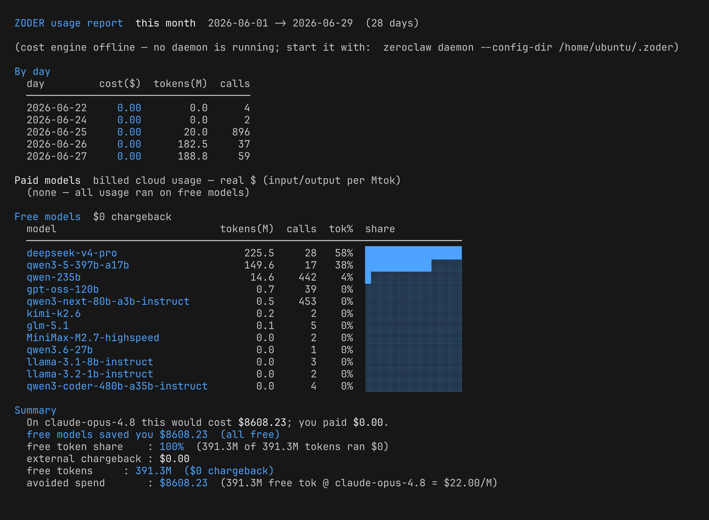
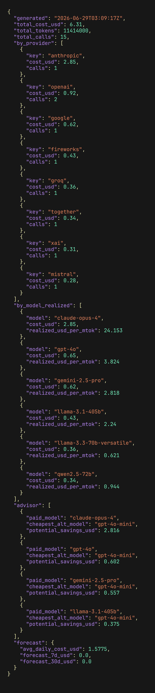

# zoder

**The full-stack developer's AI pair-coding and headless coding-dispatch system —
free-first, cost-governed, MNEMOS-first.**

zoder is to [ZeroClaw](https://github.com/zeroclaw-labs/zeroclaw) what Ubuntu is
to Debian: a curated, opinionated distribution built on the same engine, aimed at
a specific audience. ZeroClaw is the general-purpose agent framework; zoder is the
developer-facing build of it — tuned for two jobs:

1. **Interactive pair-coding** at the terminal (the `zerocode` TUI), and
2. **Headless, automated coding dispatch** — running zoder as a worker in a
   *hive* of agents that pick up coding tasks, run them on the cheapest capable
   model, review, fix, and report cost — with no human in the loop.

It routes work to **free / open-weight models first**, refuses to silently fall
back to a paid backend, tracks every call in a local spend ledger, and produces
FinOps-style chargeback reports that show — in dollars — what the free path saved.

zoder is **vendor-neutral**: it works against any OpenAI-compatible / LiteLLM
endpoint. Free, open-weight providers are first-class; enterprise gateways are
added via config overlays, never hardcoded.

### Relationship to ZeroClaw (a friendly fork)

zoder **consumes ZeroClaw's `master`** and carries its own enhancements as a
clean, rebasing patch stack on the [`ncz-os/zeroclaw`](https://gitlab.com/ncz-os/zeroclaw)
fork (branch `zoder-integration`; see [`docs/VENDORING.md`](docs/VENDORING.md)).
The fork exists because the *objectives* differ, not out of antagonism: we keep
ingesting upstream, and ZeroClaw is free to adopt any of our patches. We do **not**
open PRs upstream — our roadmap lives here. `scripts/package.sh` builds the
engine + `zerocode` UI from the fork and ships them next to the `zoder` binary.

### Part of the ncz-os family — MNEMOS-first

zoder belongs to the **ncz-os** family and is **MNEMOS-first** for memory and
data: when a MNEMOS datastore is configured, memories and sessions are logged
directly to it. zoder ships **database-backed session persistence**
(PostgreSQL / MySQL / Oracle / Db2, feature-gated) as the durable backend for
that history — so a hive of headless workers shares one system of record instead
of scattered local files.

---

## TL;DR

```bash
# Run a coding task — zoder picks the best FREE model automatically.
zoder "refactor this function for readability" < src/foo.rs

# Non-interactive (CI/automation), codex-compatible. `-` reads stdin.
zoder exec -

# Multi-model code review with a consensus verdict.
zoder review

# Review -> agent applies fixes in place -> re-review, until it passes.
zoder fix

# See which model the router would choose (and the fallback chain).
zoder route "write a unit test"

# See your spend and how much the free models saved you.
zoder report
```

| Command | What it does |
|---|---|
| `zoder "<prompt>"` / `zoder exec` | Run a task through the free-first router (codex-compatible; `-` reads stdin). |
| `zoder review` | Fan a code review to a panel of models and reach a consensus verdict. |
| `zoder fix` | Review → agent applies fixes in place → re-review, looping until it passes. |
| `zoder route` | Show the model the router would pick + the cross-family fallback chain. |
| `zoder report` | Usage + chargeback report: daily/weekly/by-model, with the savings headline. Pass `--vendor <name>` to scope to a TOML-defined vendor (e.g. `enterprise`, `ibm`, `microsoft`). |
| `zoder spend` | Raw spend rollups from the local ledger. |
| `zoder models` | List the classified model corpus (free routing pool by default). |
| `zoder health` | Per-model circuit-breaker state + measured latency. |
| `zoder refresh` | Reconcile the corpus against the live served-model list. |
| `zoder sessions` | List saved multi-turn sessions. |
| `zoder config` | Show / validate configuration + corpus. |
| `zoder completions` | Shell completions (bash/zsh/fish/powershell/elvish). |

Everything is **local-first**: routing, the ledger, health, and reports work on
your workstation with no service to stand up.

---

## Why zoder exists

Teams spend real money on frontier LLM APIs while excellent open-weight models
are available for free or near-free. zoder closes that gap by making the free
path the default path:

- **Conserve spend.** Free and open-weight models cost $0. zoder routes to them
  first and only touches a paid frontier model when you explicitly opt in — then
  it shows you, in dollars, exactly what you saved.
- **Exercise open-weight models.** Every task that runs on an open-weight model
  is real-world use of that stack. zoder turns daily coding into continuous,
  measured evaluation of the free fleet.
- **Make cost safety structural, not advisory.** The policy gate is
  **default-deny-paid**. A post-call guard inspects each call's telemetry so a
  model treated as "free" can't silently bill you through a provider-side
  free→paid fallback. A free workflow stays free, provably.

---

## How it works

A single `zoder` run is a short, auditable pipeline:

1. **Classify.** zoder maintains a *corpus* of the models your endpoint serves,
   each tagged free or paid (from live pricing) and scored for capability
   (LMArena Elo + SWE-bench) and measured latency/throughput.
2. **Route.** For your task it picks the **best free model** for the tier,
   skipping any model whose health circuit-breaker is open, and prepares a
   **cross-family fallback chain** so a single provider outage can't strand you.
3. **Run.** The task executes on the chosen model through the zerocore engine
   (streaming, retries, timeouts, sessions).
4. **Verify free.** A post-call guard checks the call's real cost/host
   telemetry. If a "free" model was actually billed, that's a policy violation —
   it's recorded and the run exits non-zero.
5. **Record.** Every call (free included) is appended to a local spend ledger:
   timestamp, provider, model, tokens in/out, cost.
6. **Report.** `zoder report` rolls the ledger up, prices it from a refreshable
   catalog, and reconciles it against your provider's billing.

Paid models are never reached by accident: they are off by default and require
an explicit opt-in.

---

## Systems architecture

zoder is layered on the **ZeroClaw / zerocore** foundation (vendored from the
`ncz-os/zeroclaw` fork). Each layer is independently useful; together they make a
complete coding system.


**zerocore — the foundation.** ZeroClaw's agent/turn engine and its
OpenAI-compatible provider abstraction. zoder rides on the fork's loop and
inherits streaming, retries, timeouts, and sessions instead of reimplementing
them. This is the part that actually talks to models. Durable session history is
pluggable: a JSONL file by default, or a **networked database backend**
(PostgreSQL / MySQL / Oracle / Db2) / **MNEMOS** when configured.

**zerocode — the terminal UX.** The interactive pair-coding experience. It
surfaces cost at the point of decision: a free-vs-paid model picker, per-turn and
session cost, and a live savings readout (one color for $0 work, another for real
paid spend).

**zoder — the governance + dispatch layer.** The cost- and quality-governance
brain. It provides the classified model **corpus**, the **free-first router**
with cross-family fallback, the **default-deny-paid policy gate** with its
anti-paid-fallback guard, per-model **health** (circuit breaker + measured
latency), **multi-model review / agentic fix**, and the **headless dispatch**
surface (`zoder exec -`) that lets a hive of workers run coding tasks
unattended. It is the part that turns ZeroClaw into a *distribution*.

**Pricing engine + FinOps reporting.** A deterministic, conformance-tested
pricing engine (with an optional live LiteLLM/OpenRouter cache) prices every call
so the savings headline and chargeback numbers are real, not estimated.

**Cost accounting + reporting (ledger-backed).** This is what makes the savings
real and visible:

- Every call lands in a local append-only **spend ledger** (timestamp, provider,
  model, tokens, cost) — free calls included, so adoption is measurable.
- A refreshable **pricing catalog** prices each call; free models resolve to $0.
- `zoder report` rolls the ledger up into daily / weekly / by-model views with an
  **avoided-spend** headline and a free-token share.

**Model rankings — LMArena (Elo) + SWE-bench.** Selection is driven by *synced*
rankings, not a hardcoded table: **LMArena Elo** for general capability and
**SWE-bench Verified** for coding skill. Because zoder is a coding tool, the
router ranks **SWE-bench-primary, Elo-secondary**, filtered free-first and
health-aware. Both the model catalog and the rankings refresh periodically and
are cached, so nothing goes stale in the binary.

---

## Example: `zoder report`

A real `zoder report` (this month) — every call routed to a free open-weight
model served via an enterprise gateway, so **391M tokens across 998 calls cost
$0**. The counterfactual headline shows what the same work would have cost on a
frontier model — **$8,608 avoided**:



zoder's cost engine is shared with **[tokenomics](https://gitlab.com/ncz-os/tokenomics)**,
the unified LLM-spend ledger across Hermes, Goose, OpenClaw, and zoder. tokenomics
also provides the **FinOps observability** view (spend allocation, realized
$/Mtok, a cheapest-equivalent advisor, and a burn forecast) over the same ledger:



> tokenomics: repo <https://gitlab.com/ncz-os/tokenomics> (mirror
> <https://github.com/ncz-os/tokenomics>) · package
> [`ncz-tokenomics`](https://pypi.org/project/ncz-tokenomics/).

The text form below is illustrative.

```
ZODER usage report  2026-06-15 -> 2026-06-24  (10 days)

Daily
  day              cost($)   tokens(M)    calls
  2026-06-15         12.40        18.2       42
  2026-06-16          8.10        14.0       31
  2026-06-17          3.25        10.5       22
  2026-06-18          0.00        12.1       28
  2026-06-19          0.00        15.7       35
  2026-06-23          0.00        11.4       26
  2026-06-24          0.00         8.0       19

By model
  model                                cost($)  tokens(M)   calls  tier  tok%  share
  GPT 5.5                                23.74       31.2      58  PAID   28%  ███████░░░░░░░░░
  Claude Opus 4.6                         9.85        6.1      12  PAID    6%  █░░░░░░░░░░░░░░░
  llama-3.3-70b-instruct                  0.00       34.7      71  free   31%  ████████████████
  qwen3-coder-480b                        0.00       28.9      60  free   26%  █████████████░░░
  deepseek-v4-flash                       0.00       10.0      24  free    9%  █████░░░░░░░░░░░

Summary
  On GPT 5.5 this would cost $154.15; you paid $33.59.
  free models saved you $120.56  (4.6x cheaper)
  free token share    : 66%  (73.6M of 110.9M tokens ran $0)
  top cost driver     : GPT 5.5  71% of spend ($23.74)
  external chargeback : $33.59
  free tokens         : 73.6M  ($0 chargeback)
  avoided spend       : $102.30  (73.6M free tok @ GPT 5.5 = $1.39/M)
```

What the report is telling you at a glance:

- **The counterfactual** — what this period *would* have cost on the frontier
  baseline vs what you actually paid, and the multiple ("4.6x cheaper"). This is
  the headline number for free-model adoption.
- **Free token share** — proof the free models are doing real work (66% of
  tokens), not just that calls were avoided.
- **Top cost driver** — the one model eating most of your remaining spend.

### Vendor-scoped reports: `zoder report --vendor <name>`

To see what your spend looks like against *one* vendor's providers — useful for
chargeback to a team, an org, or a finance review — pass `--vendor`. The flag
filters the ledger to entries whose `provider` id was contributed by the named
vendor's TOML, then **recomputes totals, the counterfactual, and the
avoided-spend headline over that slice**, so the headline numbers are the
vendor's story, not the whole mixed fleet:

```
$ zoder report --period ytd --vendor enterprise
ZODER usage report  YTD 2026  vendor=enterprise  2026-01-01 -> 2026-06-27  (178 days)
filtered to providers: enterprise-gateway, enterprise-nim

Daily
  day              cost($)   tokens(M)    calls
  …

By model
  model                                cost($)  tokens(M)   calls  tier
  llama-3.3-nemotron-super-49b          0.00      142.6     318  free
  llama-3.1-nemotron-70b-instruct        0.00       88.1     201  free
  …

Summary
  On GPT 5.5 this would cost $1,140.20; you paid $0.00.
  …
```

`--vendor` is invalid unless `~/.zoder/config.<name>.toml` is present and
contributes at least one `[[providers]]` entry — zoder exits non-zero with a
clear message listing the vendors it does see. Add a new vendor by copying
`config.ibm.toml` (a commented template) to `config.<name>.toml`, uncomment
the `[[providers]]` blocks, and you're done — no code change.

JSON output includes `vendor` and `vendor_provider_ids` keys when `--vendor`
is set, so dashboards can pin to a specific vendor slice without re-parsing
the by-model table.

---

## Install / build targets

### Download — prebuilt trio (zoder + zerocode + zeroclaw)

Each release ships a version-matched tarball with all three binaries — `zoder`
(the CLI), `zerocode` (the TUI), and `zeroclaw` (the engine) — plus `INSTALL.txt`
and `LICENSE`. Grab the tarball for your platform from the releases page —
GitLab <https://gitlab.com/ncz-os/zoder/-/releases> or GitHub
<https://github.com/ncz-os/zoder/releases> — then:

```bash
tar -xzf zoder-<ver>-<target>.tar.gz
sudo install zoder-<ver>-<target>/{zoder,zerocode,zeroclaw} /usr/local/bin/
zoder --help          # the trio is now on your PATH
```

Targets: `x86_64-unknown-linux-gnu`, `aarch64-unknown-linux-gnu`,
`aarch64-apple-darwin`, `x86_64-apple-darwin`. An `install.sh` (download + verify
+ install the trio) is attached to each release. Each tarball is accompanied by a
`.sha256` you can verify with `sha256sum -c`.

### Build from source

zoder builds natively for:

| Platform | Target |
|---|---|
| macOS arm (Apple Silicon) | `aarch64-apple-darwin` |
| macOS x86_64 (Intel) | `x86_64-apple-darwin` |
| linux x86 | `x86_64-unknown-linux-gnu` |
| linux arm | `aarch64-unknown-linux-gnu` |

- Local build: `./scripts/build.sh mac` (or `mac-x86`, `linux`).
- Release targets: the CI matrix in `.github/workflows/release.yml` (native runners).
- The quality gate (`.github/workflows/quality-gate.yml` on GitHub, `.gitlab-ci.yml`
  on GitLab) runs fmt / clippy `-D warnings` / build+check / nextest / cargo-deny.

### Windows? Use WSL.

**zoder does not ship a native Windows build.** Its engine relies on Unix domain
sockets and a Unix-oriented runtime, and the developer workflows it targets assume
a POSIX environment. Windows users should run zoder inside **WSL2** (Ubuntu or any
glibc distro) — install the Linux target there and it behaves exactly as it does on
native Linux. This is a deliberate ncz-os policy, not a temporary gap: there is no
Windows target in the build or CI matrix.

---

## Configuration

zoder reads `~/.zoder/` (override with `$ZODER_HOME`): `config.json`, the model
corpus, the spend ledger, and the pricing catalog. Without a config it falls
back to a single OpenAI-compatible provider entry you can point at any endpoint.
A paid frontier provider can be added but is **default-deny** and only used on
explicit opt-in.

### Budget caps (pre-call estimate)

Beyond the per-model paid/free gate, zoder can gate on **projected dollars**.
Before a paid call it estimates the cost (prompt tokens × the pricing catalog,
plus an assumed output size) and checks it against optional caps. A call that
would breach a cap prompts the same confirmation as a paid model; `--allow-paid`
bypasses it, and a $0 (free-model) estimate is never gated.

```json
{
  "budget": {
    "max_cost_per_call_usd": 0.50,
    "monthly_cap_usd": 100.0,
    "est_output_tokens": 1024
  }
}
```

- `max_cost_per_call_usd` — confirm any single call estimated above this.
- `monthly_cap_usd` — confirm a call that would push **month-to-date** ledger
  spend (current calendar month) over this total.
- `est_output_tokens` — assumed completion size for the estimate (default 1024).

Omit the `budget` block (or any field) for no cap. The estimate is a ballpark
(token counts are approximate until the call's real telemetry lands in the
ledger); it is a guard rail, not a hard meter.

### Vendor overlays: `config.<name>.toml`

`Config::load()` reads `config.json` (or the default free-tier config) and
then layers every `config.<vendor>.toml` in the same directory on top. Each
TOML is a vendor profile (e.g. `config.enterprise.toml`, `config.ibm.toml`,
`config.microsoft.toml`) that contributes additional `[[providers]]` and,
optionally, a `[profile]` table that selects a `default_provider`. The TOMLs
are the source of truth for what counts as a given org's spend
in `zoder report --vendor <name>`.

```toml
# config.enterprise.toml — an Enterprise gateway profile.
[[providers]]
id = "enterprise-gateway"
base_url = "https://YOUR_ENTERPRISE_GATEWAY/v1"
kind = "openai-chat"
auth = { type = "env", var = "ENTERPRISE_API_KEY" }
# — or, for gateways that use an api-key request header (e.g. Azure OpenAI):
# auth = { type = "api_key_header", header = "api-key", var = "ENTERPRISE_API_KEY" }
paid = true
billing = "metered"

[profile]
name = "enterprise"
# default = false   # leave config.json's default_provider alone
```

Rules the loader enforces (fail loud, don't silently merge):

- **Duplicate provider `id` across two overlays is a hard load error.** Rename
  one in the offending TOML; last-wins is disabled so misconfigurations don't
  masquerade as working installs.
- **At most one overlay may set `[profile].default = true`.** Multiple
  defaults = ambiguous routed-default = error.
- **`[profile].default_provider` must name a provider the same overlay
  contributes.** Otherwise the routed default would point at a non-existent
  provider.
- **An overlay with no `[[providers]]` and no `[profile].default` is an
  error.** A file that does nothing is almost certainly a half-finished
  template — delete it instead of leaving it on disk.

Adding a new vendor is a copy-paste exercise:

1. `cp config.ibm.toml config.<name>.toml` (the IBM/Microsoft templates are
   fully commented out as starters).
2. Fill in `id`, `base_url`, `kind`, and `auth` for each provider. Use the
   matching `ENTERPRISE_API_KEY` / `AZURE_OPENAI_API_KEY` / etc. env var name.
3. Set `paid = true` / `billing = "metered"` for token-billed providers; the
   policy gate uses `paid` to decide whether a call is a "free fallback" or a
   "paid escalation".
4. Drop the file in `~/.zoder/` (or `$ZODER_HOME`). `zoder config --validate`
   will catch the obvious errors and `zoder report --vendor <name>` will pick
   it up automatically — no restart, no re-install.

`free_api_hosts` lives on the base `Config` (not on overlays), so any new
vendor host that should be treated as free for the policy gate still needs to
be added to `config.json`'s `free_api_hosts` array — TOML overlays cannot
extend that list. This is intentional: free-tier policy is a security knob,
not a vendor knob.

**Keep enterprise specifics out of the public tree.** The public zoder source
refers only to a generic **`enterprise`** profile. A real organization's gateway
URLs, auth header names, and report color scheme belong in *its own* private
config repo (e.g. an internal `zoder-config`), kept out of this repository and
synced into `$ZODER_HOME` at deploy time — `scripts/package.sh` honors a
`CONFIG_REPO` hook for exactly this. That keeps vendor identity and endpoints
private while the public code stays vendor-neutral.

### Report color scheme

An overlay's `[theme]` table sets the named color palette `zoder report` uses for
that vendor's reports, so a chargeback view can match an org's brand without any
code change.

---

## License

Apache-2.0. See [`LICENSE`](LICENSE).
